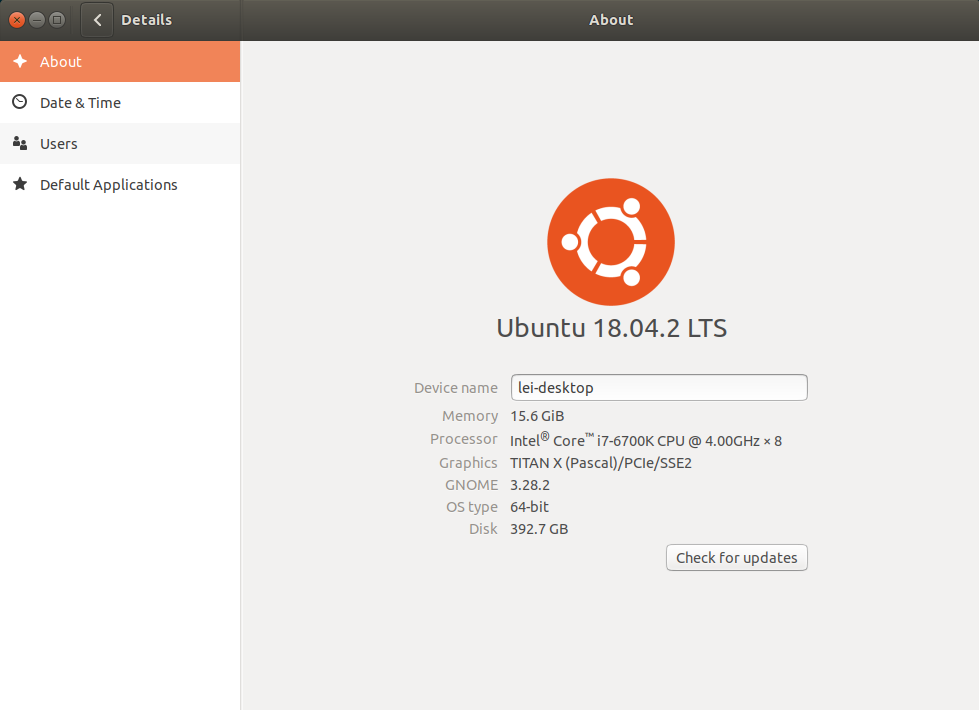
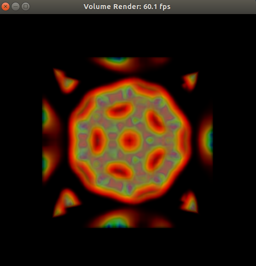

# A tutorial to set up deep learning environment in Ubuntu 18.04

In this tutorial, I will present how to build up deep learning environment in desktop. In my opinion, linux has much better performance than window 10. Everything should be done in about 2 hours. Vim is my default text editor in linux, so I will first introduce some basics in vim. If you are interested, I also attached my vimrc file. In the current compatible meta, CUDA 10.0 and anaconda-python 3.6 which are the latest versions supported by tensorflow-gpu-1.13 (ts2.0 is not stable yet). 

<div align=center></div>

## Table of content
<!-- vim-markdown-toc GFM -->

* [Basic tools](#basic-tools)
    * [1. Vim](#1-vim)
    * [2. Git](#2-git)
    * [3. GCC](#3-gcc)
* [GPU driver, CUDA and cuDNN](#gpu-driver-cuda-and-cudnn)
    * [1. Install the latest Nvidia driver](#1-install-the-latest-nvidia-driver)
    * [2. Install CUDA](#2-install-cuda)
    * [3. Install cuDNN](#3-install-cudnn)
    * [4. Keep multiple versions of CUDA](#4-keep-multiple-versions-of-cuda)
    * [5. Verify GPU driver, CUDA and cuDNN](#5-verify-gpu-driver-cuda-and-cudnn)
* [Python environment](#python-environment)
    * [1. Install miniconda](#1-install-anaconda)
    * [2. Python packages](#2-python-packages)

<!-- vim-markdown-toc -->
## Basic tools

### 1. Vim
Personally, I prefer to use vim as default text editor.
* Run ```sudo apt-get install vim``` to install vim from terminal.
* Type ```i``` to enter insert mode and press ESC to return to normal mode. In insert mode, one can edit text like regular text editor while normal mode "protects" file from being changed. Type ```:wq``` to save changes and leave vim. These moves should be sufficient to help in the following parts.
* For a more detailed introduction of vim, please refer to [here](https://github.com/slme1109/myConfigFiles).

### 2. Git
As we need to clone some repos from github in some installations, it is necessary to install git.
* Run ```sudo apt-get install git``` to install git from shell
* Run ```git config --global user.email "you@example.com"``` to add your github account
* Run ```git config --global user.name "Your Name"``` to add your name (not necessarily your github name)
* Run ```git config credential.helper store``` if you do not want to type username and password everytime you do git push.

### 3. GCC
Install corresponding GCC version for CUDA. For Ubuntu-18.04 and CUDA-10.0, GCC-7.3 is the [highest version supported](https://docs.nvidia.com/cuda/cuda-installation-guide-linux/index.html). Download [GCC-7.3](https://ubuntu.pkgs.org/18.04/ubuntu-main-amd64/gcc-7_7.3.0-16ubuntu3_amd64.deb.html) and double click it to install.
```
$ gcc --version
gcc (Ubuntu 7.3.0-27ubuntu1~18.04) 7.3.0
Copyright (C) 2017 Free Software Foundation, Inc.
This is free software; see the source for copying conditions.  There is NO
warranty; not even for MERCHANTABILITY or FITNESS FOR A PARTICULAR PURPOSE.
```
## GPU driver, CUDA and cuDNN
### 1. Install the latest Nvidia driver
It would just be one line of code, if you do not care about using up-to-date driver. I am sure newer driver makes notable difference and it is worth spending time on.
* Install required dependencies, ```sudo apt-get install freeglut3-dev build-essential libx11-dev libxmu-dev libxi-dev libgl1-mesa-glx libglu1-mesa libglu1-mesa-dev libfreeimage3 libfreeimage-dev```
* Remove preinstalled driver, ```sudo apt-get remove --purge nvidia*```
* To diable nouveau, run ```sudo vim /etc/modprobe.d/blacklist.conf``` and add following two lines to it.
    ```
    blacklist nouveau
    options nouveau modeset=0
    ```
* Make it effective ```sudo update-initramfs -u``` and reboot.
* System becomes 800*600 resolution after reboot. Run ```lsmod | grep nouveau``` and if nothing shows up, it means nouveau is successfully disabled.
* Download driver from [Nvidia website](https://www.nvidia.com/Download/index.aspx?lang=en-us)
* To make the file excutable, run ```sudo chmod 777 NVIDIA-Linux-x86_64-418.74.run``` and run ```sudo ./NVIDIA-Linux-x86_64-418.74.run --no-opengl-files --no-x-check --no-nouveau-check``` to install the driver. Note that OPENGL yields login loop issue. X-check leads to question 'Would you like to run the nvidia-xconfig utility to automatically update your X configuration file…'. Remember to select no if popped out.
* Reboot and run ```nvidia-smi``` or ```nvidia-setting``` to obtain gpu driver info. The resolution becomes normal after rebooting.
    
    ```
    $ nvidia-smi 
    +-----------------------------------------------------------------------------+
    | NVIDIA-SMI 418.56       Driver Version: 418.56       CUDA Version: 10.1     |
    |-------------------------------+----------------------+----------------------+
    | GPU  Name        Persistence-M| Bus-Id        Disp.A | Volatile Uncorr. ECC |
    | Fan  Temp  Perf  Pwr:Usage/Cap|         Memory-Usage | GPU-Util  Compute M. |
    |===============================+======================+======================|
    |   0  TITAN X (Pascal)    Off  | 00000000:01:00.0  On |                  N/A |
    |  0%   36C    P0    55W / 250W |    937MiB / 12194MiB |      0%      Default |
    +-------------------------------+----------------------+----------------------+
    ```                                                                               
    CUDA version is 10.1 as it comes with GPU driver. The highest version of CUDA supported by tensorflow is 10.0. Below shows the intruction of how to install CUDA independently and manage multiple versions by using symbolic link.

### 2. Install CUDA
* [Download CUDA](https://developer.nvidia.com/cuda-10.0-download-archive) from Nvidia, choose ```.run``` file since ```.deb``` will replace Nvidia driver with lower version
* cd to the folder and run ```sudo sh cuda_10.0.130_410.48_linux.run```
* Press Enter till question pop out:

    -----------------
    * Do you accept the previously read EULA?
      
      accept/decline/quit: accept

    * Install NVIDIA Accelerated Graphics Driver for Linux-x86_64 410.48? # no as driver is installed
      
      (y)es/(n)o/(q)uit: no

    * Install the CUDA 10.0 Toolkit?
      
      (y)es/(n)o/(q)uit: yes

    * Enter Toolkit Location # press enter if default
      
      [ default is /usr/local/cuda-10.0 ]: 

    * Do you want to install a symbolic link at /usr/local/cuda? # we will create symbolic link by ourselves
      
      (y)es/(n)o/(q)uit: y

    * Install the CUDA 10.0 Samples? # depends on whether you want to run the test.
      
      (y)es/(n)o/(q)uit: y

    * Enter CUDA Samples Location # press Enter for default
      
      [ default is /home/leishan ]: 

    Installing the CUDA Toolkit in /usr/local/cuda-10.0 ...
    
    Installing the CUDA Samples in /home/leishan ...
    
    Copying samples to /home/leishan/NVIDIA_CUDA-10.0_Samples now...
    
    Finished copying samples.

* Verify the verision installed, ```cat /usr/local/cuda/version.txt```
    ```
    $ cat /usr/local/cuda/version.txt
    CUDA Version 10.0.130
    ```

### 3. [Install cuDNN](https://docs.nvidia.com/deeplearning/sdk/cudnn-install/index.html)
* Download [cuDNN Library for Linux](https://developer.nvidia.com/rdp/cudnn-download).
* Unzip through ```tar -xzvf cudnn-10.0-linux-x64-v7.tgz```
* Copy files from unzipped folder to CUDA folder (not symbolic one):
    ```
    sudo cp cuda/include/cudnn.h /usr/local/cuda-10.0/include
    sudo cp cuda/lib64/libcudnn* /usr/local/cuda-10.0/lib64
    sudo chmod a+r /usr/local/cuda-10.0/include/cudnn.h /usr/local/cuda-10.0/lib64/libcudnn*
    ```
* Verify version installed, ```cat /usr/local/cuda/include/cudnn.h | grep CUDNN_MAJOR -A 2```.

    ```
    $ cat /usr/local/cuda/include/cudnn.h | grep CUDNN_MAJOR -A 2
    #define CUDNN_MAJOR 7
    #define CUDNN_MINOR 5
    #define CUDNN_PATCHLEVEL 0
    --
    #define CUDNN_VERSION (CUDNN_MAJOR * 1000 + CUDNN_MINOR * 100 + CUDNN_PATCHLEVEL)

    #include "driver_types.h"
    ```

### 4. Keep multiple versions of CUDA
* Delete symbolic folder ```sudo rm -rf /usr/local/cuda```
* Create a symbolic link from cuda-10.0 to a new folder cuda by running ```sudo ln -s /usr/local/cuda-10.0/ /usr/local/cuda```. 
* Add the following at the end of ```~/.bashrc```(add symblic folder as envir variables)

    ```
    export LD_LIBRARY_PATH=$LD_LIBRARY_PATH:/usr/local/cuda/lib64
    export PATH=$PATH:/usr/local/cuda/bin
    export CUDA_HOME=$CUDA_HOME:/usr/local/cuda
    ```
* ```source ~/.bashrc``` and restart the terminal
* Run ```nvcc -V``` to verify the current CUDA version

    ```
    $ nvcc -V
    nvcc: NVIDIA (R) Cuda compiler driver
    Copyright (c) 2005-2018 NVIDIA Corporation
    Built on Sat_Aug_25_21:08:01_CDT_2018
    Cuda compilation tools, release 10.0, V10.0.130
    ```


### 5. Verify GPU driver, CUDA and cuDNN
If you see, ```Result = PASS``` for first two tests, drivers are installed properly.
* Test #1 
    ```
    cd /usr/local/cuda-10.0/samples/1_Utilities/deviceQuery
    sudo make
    ./deviceQuery
    ```
* Test #2 (followd by test one) 
    ```
    cd ../bandwidthTest
    sudo make
    ./bandwidthTest
    ```
You will see a fancy picture if you do the test three below.
* Test #3
    ```
    cd ~/NVIDIA_CUDA-10.0_Samples/2_Graphics/volumeRender
    sudo make
    ./volumeRender
    ```
<div align=center></div>

## Python environment

### 1. Install miniconda
Miniconda is a great python tool to manage packages.
* Download [the latest miniconda](https://docs.conda.io/en/latest/miniconda.html)
* Install miniconda, ```bash Anaconda3-5.2.0-Linux-x86_64.sh```
* Create environment, ```conda create --name dlpy36 python=3.6```
* Install required deep learning python packages under dlpy36. [Check here](https://www.digitalocean.com/community/tutorials/how-to-install-anaconda-on-ubuntu-18-04-quickstart).
* For newly opened terminal, run ```source activate dlpy36``` to switch on the environment with all required package installed.

### 2. Python packages
Make sure you are in the dlpy36 environment and then do the following,
```
pip install keras (numpy will installed)
pip install tensorflow-gpu (only support py3.6)
pip install -U scikit-learn
pip install pandas
pip install seaborn (matplotlib will installed)
pip install -U gensim
```
Now you have installed necessary dependencies if you are using Keras for deep learning projects. Try to avoid using conda installing packages, as they are not up-to-date. Besides, conda-forged tensorflow will install low verisions of CUDA and cuDNN.

To add torch support
```
sudo apt install python3-pip
pip3 install torch torchvision
```
